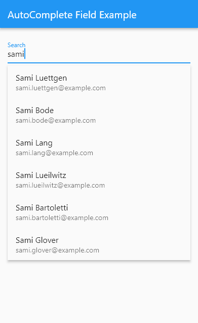

# Flutter autocomplete_field package

Flutter AutoCompleteField widget.

## ScreenShot


## Features

This AutoCompleteField widget autocomplete as you type

## Usage

TODO: Include short and useful examples for package users. Add longer examples
to `/example` folder. 

```dart
AutoCompleteField<User>(
    decoration: const InputDecoration(labelText: 'Search'),
    delegate: (query) async {
        final result = await ApiService.search(query);
        return result;
    },
    itemBuilder: (context, item) => ListTile(title: Text(item)),
    onItemSelected: (item) => print(item),
)
```
